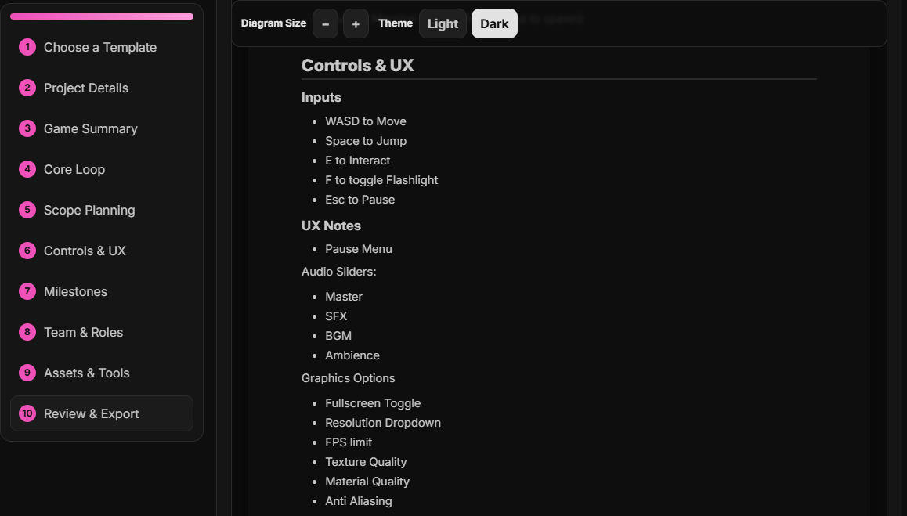

# GDD Wizard (Markdown Enhanced)

> **Modified version of [Studio-Erza's GDD Wizard](https://github.com/Studio-Erza/gdd-wizard)**
>
> All original assets, design, and code © Studio-Erza. This fork adds Markdown formatting support for enhanced document organization.

---

## 🎮 About

**GDD Wizard** is a lightweight, browser-based tool for creating professional Game Design Documents (GDDs). No installs, accounts, or downloads required — just open and start designing!

### ✨ Original Features (by Studio-Erza)
- **Core Loop Design** - Visualize your game's flow
- **Mechanics & Features** - Document gameplay systems
- **Story & Setting** - Build your game world
- **Marketing Plans** - Target audience and monetization
- **Team Management** - Track roles and milestones
- **PDF Export** - Clean, professional documents
- **Offline Support** - Works as a Progressive Web App (PWA)
- **Privacy First** - All data stays in your browser

### 📝 Markdown Enhancement (This Fork)

This modified version adds **full Markdown support** to all text fields, enabling:
- **Lists** (bullet and numbered)
- **Line breaks** and paragraph formatting
- **Bold** and *italic* emphasis
- **Headers** for better organization
- **Links** and inline code
- Better readability in exported PDFs

---

## 🚀 Quick Start

### Run Online
**👉 [Launch GDD Wizard](https://nazethium.github.io/gdd-wizard/)**

### Install as PWA (Offline Access)

**Chromium Browsers** (Chrome, Edge, Brave, Opera):
1. Visit https://nazethium.github.io/gdd-wizard/
2. Click the install icon (⬇️ monitor icon) in the address bar
3. Click "Install"

The app will work offline and appear in your apps list!

---

## 📖 Markdown Guide

All text fields now support Markdown formatting. Here's what you can use:

### Text Styling
```markdown
**bold text**          → bold text
*italic text*          → italic text
`inline code`          → inline code
[Link Text](url)       → clickable link
```

### Lists
```markdown
Bullet Lists:
- Item 1
- Item 2
  - Sub-item (use 2 spaces)

Numbered Lists:
1. First item
2. Second item
3. Third item
```

### Line Breaks & Paragraphs
```markdown
Single line break: Just press Enter once
(Works with breaks: true option)

Paragraph break: Press Enter twice

To create distinct sections
```

### Headers
```markdown
# Main Header
## Sub Header
### Smaller Header
```

---

## 🖼️ Markdown in Action

### Example: Controls & UX Section

**Input Field (with Markdown):**


**PDF Output (Rendered):**



Notice how the raw Markdown syntax (`- Item`) in the input becomes properly formatted bullet points in the PDF export!

---

## 🛠️ Technical Details

### What Was Modified

This fork adds Markdown parsing to the GDD Wizard:

1. **Added Library**: [Marked.js v11.1.1](https://marked.js.org/) (via CDN)
2. **Modified Files**:
   - `index.html` - Added Marked.js script tag
   - `js/content.global.js` - Added `parseMarkdown()` function and updated render functions

3. **Updated Functions**:
   - `renderSummary()` - Genre, Core Fantasy, etc.
   - `renderMarketing()` - Audience descriptions
   - `renderFeatures()` - Feature titles and descriptions
   - `renderCoreLoop()` - Example session text
   - `renderMilestones()` - Milestone notes
   - Grouped notes sections

### Original Code Preserved

Original `escapeHtml()` calls are preserved as comments in `js/content.global.js` for easy reversion if needed.

### How It Works

- **Before**: User text was escaped with `escapeHtml()` (plain text only)
- **After**: User text is parsed with `parseMarkdown()` (supports formatting)
- **Fallback**: If Marked.js fails to load, automatically falls back to `escapeHtml()`

---

## 📦 Local Development

### Run Locally

```bash
# Clone this repository
git clone https://github.com/Nazethium/gdd-wizard.git
cd gdd-wizard

# Start a local server (Python 3)
python -m http.server 8000

# Open browser to:
http://localhost:8000
```

### Making Changes

1. Edit files in your local copy
2. Refresh browser (use `Ctrl+Shift+R` for hard refresh)
3. **Note**: Service workers cache aggressively
   - Disable in DevTools → Application → Service Workers during development
   - Or use Incognito mode for testing

---

## 🤝 Attribution & License

### Original Project
**GDD Wizard** by [Studio-Erza](https://studio-erza.itch.io/)
- GitHub: https://github.com/Studio-Erza/gdd-wizard
- Itch.io: https://studio-erza.itch.io

All original design, assets (logos, icons), and core functionality belong to Studio-Erza.

### This Fork
**Markdown Enhancement** by [Nazethium](https://github.com/Nazethium)
- GitHub: https://github.com/Nazethium/gdd-wizard
- Live Demo: https://nazethium.github.io/gdd-wizard/

**Modifications**: Added Markdown parsing functionality for educational purposes. All changes are documented and original code is preserved in comments.

**Third-Party Library**: This fork uses [Marked.js](https://marked.js.org/) (MIT License) for Markdown parsing.

---

## 📄 License

Please refer to the original [Studio-Erza GDD Wizard repository](https://github.com/Studio-Erza/gdd-wizard) for licensing information.

Modifications in this fork are provided as-is for educational purposes.

---

## 🙏 Credits

- **Original Tool**: Studio-Erza - For creating the excellent GDD Wizard
- **Markdown Library**: [Marked.js](https://marked.js.org/) by Christopher Jeffrey and contributors
- **Markdown Enhancement**: Community-driven improvement for better document formatting

---

## 📞 Support

### For Original GDD Wizard Issues
Contact Studio-Erza through their [GitHub repository](https://github.com/Studio-Erza/gdd-wizard)

### For Markdown-Specific Issues
Open an issue on this fork: https://github.com/Nazethium/gdd-wizard/issues

---

**Happy Game Designing! 🎮✨**
